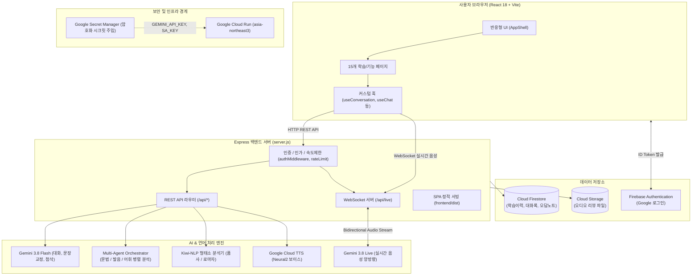

# 훈민정음 (Hangul Now) 프로젝트 종합 기술 문서 & 가이드

> **안내**: 본 문서는 Hangul Now 프로젝트의 전체 아키텍처, 코드베이스 구조, 페이지별 기능 및 실행 흐름을 정리한 종합 기술 명세서입니다.  
> **[진행 상황]** 섹션은 새로운 작업 단계를 완료하거나 핵심 로직/파일 구조를 변경할 때마다 실시간으로 업데이트됩니다.

---

## 1. 프로젝트 개요 (Project Overview)

**Hangul Now (훈민정음)**는 외국인 학습자를 위한 차세대 메신저 중심 반응형 한국어 AI 교육 플랫폼입니다.
단순한 텍스트 챗봇을 넘어, 최신 **Google Gemini 3.8 / 2.5** 모델 제품군과 **Google Cloud Platform (GCP)** 및 **Firebase** 인프라를 결합하여 실제 한국어 튜터와 대화하듯 실시간 양방향 음성 대화, 음운 규칙 기반 발음 분석, 한국어 형태소 분석(Kiwi-NLP), 천지인 가상 키보드 기반 쓰기 첨삭, 다중 에이전트(Multi-Agent) 심층 코칭 및 자동 PDF 학습 리포트 생성을 제공합니다.

- **주요 타겟**: 한국어를 학습하고자 하는 글로벌 외국인 학습자 (영어/한국어 다국어 지원)
- **핵심 가치**: 
  - 저지연(Low-latency) 실시간 음성 상호작용 (Gemini Live WebSocket)
  - 국립국어원 표준 기반 문법/음운/어휘 다중 에이전트 코칭
  - 직관적인 모바일/데스크톱 반응형 UI 및 모바일 친화적 입력 체계 (천지인 키보드)
  - 엔터프라이즈급 데이터 보안 및 클라우드 인프라 안정성

---

## 2. 기술 스택 (Tech Stack)

| 영역 | 기술 / 라이브러리 | 용도 및 설명 |
| :--- | :--- | :--- |
| **Frontend Framework** | **React 18** (`react`, `react-dom`) | 반응형 SPA 컴포넌트 아키텍처 및 상태 관리 |
| **Frontend Build Tool** | **Vite 5** | 초고속 HMR 및 최적화된 프로덕션 정적 번들 빌드 |
| **Frontend Styling** | **Vanilla CSS** | 테마 토큰, 글래스모피즘, 고성능 애니메이션, 반응형 그리드 |
| **Backend Runtime** | **Node.js 20/22**, **tsx** | TypeScript/ESM 기반 Express 백엔드 런타임 |
| **Backend Framework** | **Express 4.21** | REST API 서버, 정적 파일 서빙, SPA 라우팅 폴백 |
| **Realtime Protocol** | **WebSocket (`ws`)** | 브라우저와 서버, 서버와 Gemini Live 간 양방향 실시간 오디오/텍스트 스트리밍 |
| **AI & LLM Engine** | **Google Gemini API** (`@google/generative-ai`) | `gemini-3.8-flash` (대화/작문), `gemini-3.5-flash-lite` (듣기·읽기·말하기 초고속 자료생성), `gemini-3.8-live-extended-thinking` (실시간 회화), `gemini-2.5-flash` (STT/발음 평가), `gemini-3.8-flash-tts` |
| **NLP & 형태소 분석** | **Kiwi-NLP (`kiwi-nlp`)** + 자체 POS 엔진 | 한국어 형태소 분석, 5품사 분류, 문장 성분(주어/서술어 등) 태깅, 국립국어원 로마자 표기 |
| **Multi-Agent** | 자체 오케스트레이터 (`orchestrator.mjs`) | 문법 에이전트, 발음 에이전트, 어휘 에이전트 병렬 협업 분석 |
| **Voice & Speech (TTS)** | **Google Cloud TTS** (`@google-cloud/text-to-speech`) | Neural2 한국어 전문 성우 보이스 백업 및 보완 |
| **Database & Auth** | **Firebase (Admin SDK & Web SDK)** | Firebase Auth (Google OAuth), Cloud Firestore, Cloud Storage |
| **Report Generation** | **PDFKit**, **Puppeteer** | 학습 세션 요약 및 복습 리포트 PDF 동적 렌더링 및 다운로드 |
| **Cloud Infrastructure** | **Google Cloud Run**, **Secret Manager** | 완전관리형 컨테이너 배포 (서울 리전 `asia-northeast3`), 암호화된 시크릿 인젝션 |
| **Testing** | **Vitest**, **Playwright** | 단위 테스트 및 브라우저 엔드투엔드(E2E) 스모크 테스트 |

---

## 3. 디렉토리 및 주요 파일 구조

```text
c:\Users\hopep\Desktop\훈민정음
├── .agent/                     # 멀티 에이전트 운영 상태 및 로그 (MIGRATION_STATE, PLANS 등)
├── .github/workflows/          # GitHub Actions CI/CD 파이프라인 (deploy.yml)
├── .cursorignore               # Cursor AI 인덱싱 차단 규칙
├── .geminiignore               # Gemini / Antigravity AI 인덱싱 차단 규칙
├── .gitignore                  # Git 추적 제외 규칙 (환경변수 및 인증서 유출 방지)
├── Dockerfile                  # Node 20 다단계 빌드 컨테이너 정의 (Vite 빌드 -> Express 런타임)
├── firebase.json               # Firebase 호스팅 및 보안 규칙 매핑
├── firestore.rules             # Firestore 데이터 보안 규칙 (본인 데이터 접근 제한)
├── README.md                   # 개발 규칙 및 운영 가이드라인
├── GEMINI.md                   # 프로젝트 종합 기술 문서 및 진행 상황 명세서 (본 파일)
│
├── frontend/                   # [React 18 + Vite 5 제품 프론트엔드]
│   ├── e2e/                    # Playwright E2E 스모크 테스트 (smoke.spec.js)
│   ├── public/                 # 브라우저 직접 제공 정적 에셋 (assets/, favicon, manifest)
│   ├── src/
│   │   ├── main.jsx            # React 애플리케이션 진입점 (ReactDOM.createRoot)
│   │   ├── App.jsx             # 전역 네비게이션, 상태 관리(Auth, Shell, Theme, Audio)
│   │   ├── pages/              # 15개 전체 페이지 컴포넌트
│   │   │   ├── IntroPage.jsx         # 서비스 진입 및 소개 화면
│   │   │   ├── HomePage.jsx          # 오늘의 학습 대시보드
│   │   │   ├── ConversationPage.jsx  # Gemini Live 실시간 1:1 음성/텍스트 회화
│   │   │   ├── SpeakingPage.jsx      # 말하기 코칭 및 발음 평가
│   │   │   ├── ListeningPage.jsx     # 듣기 연습 및 딕테이션
│   │   │   ├── ReadingPage.jsx       # 수준별 독해 및 형태소 분석 툴팁
│   │   │   ├── WritingPage.jsx       # 천지인 가상 키보드 작문 및 AI 첨삭
│   │   │   ├── ChatPage.jsx          # AI 튜터 텍스트 메신저
│   │   │   ├── RecordPage.jsx        # 마이페이지 및 학습 기록, PDF 내보내기
│   │   │   ├── TutorsPage.jsx        # AI 튜터 프로필 및 페르소나 소개
│   │   │   ├── VideoClassPage.jsx    # 1:1 화상 수업 매칭 (관리자 미리보기)
│   │   │   ├── AboutPage.jsx         # 서비스 및 팀 소개
│   │   │   ├── ResourcesPage.jsx     # 한국어 학습 자료실
│   │   │   ├── NoticePage.jsx        # 공지사항
│   │   │   └── AdminPage.jsx         # 관리자 전용 대시보드 및 지표 분석
│   │   ├── components/         # 재사용 공통 컴포넌트
│   │   │   ├── AppShell.jsx          # 헤더, 사이드바, 드로어, 튜터 선택기 래퍼
│   │   │   ├── AccountMenu.jsx       # 구글 로그인/프로필 팝오버
│   │   │   ├── OnboardingModal.jsx   # 신규 사용자 닉네임/국적/관심사 설정 모달
│   │   │   └── SitePasswordGate.jsx  # 접근 제어 비밀번호 게이트 (선택적)
│   │   ├── hooks/              # 비즈니스 로직 커스텀 훅
│   │   │   ├── useConversation.js    # Gemini Live WebSocket 연결 및 오디오 스트림 제어
│   │   │   ├── useAuthProfile.js     # Firebase Auth 로그인 상태 및 프로필 동기화
│   │   │   ├── useChat.js            # 텍스트 채팅 메시지 송수신 및 히스토리 관리
│   │   │   ├── useAudioReview.js     # 튜터 음성 리뷰 비동기 작업 폴링 및 재생
│   │   │   ├── useTutorSpeech.js     # 브라우저/서버 TTS 음성 재생 제어
│   │   │   ├── useTranslationToggle.js # 실시간 번역 표시/숨김 토글
│   │   │   └── useVideoClass.js      # 화상 수업 상태 관리
│   │   ├── data/               # 상수, 초기 상태, 모의 데이터 정의
│   │   ├── styles/             # 전역 및 페이지별 CSS 스타일시트
│   │   └── utils/              # 프론트엔드 유틸리티 (테이블 내보내기, Google Drive 연동 등)
│   └── package.json            # 프론트엔드 의존성 및 빌드 스크립트
│
├── server.js                   # [Express 백엔드 엔터프라이즈 서버]
│                               # REST API 라우트, 웹소켓 마운트, 프론트엔드 서빙, 에러 핸들링
├── src/                        # 백엔드 핵심 비즈니스 로직
│   ├── authMiddleware.js       # Firebase ID 토큰 검증, 인증/인가 미들웨어
│   ├── adminPolicy.js          # 관리자 권한 단일 판정 정책
│   ├── rateLimit.js            # AI 호출 및 고비용 요청 속도 제한 (Rate Limiter)
│   ├── geminiService.js        # Gemini 대화, 문장 교정, 작문 첨삭, 발음 평가 연동
│   ├── liveConversation.js     # Gemini Live WebSocket 중계 (Dual-Track Flow)
│   ├── tutorSession.js         # 튜터 오디오 리뷰 및 복습 잡 큐 관리
│   ├── sessionReport.js        # 학습 세션 요약 및 PDF 생성 조율
│   ├── reportPdf.js            # PDFKit 기반 한국어 리포트 렌더러
│   ├── contentGenerator.js     # 레벨별 듣기/읽기/말하기 콘텐츠 동적 생성기
│   ├── learningHistory.js      # 사용자별 학습 완료 데이터 기록 및 중복 출제 방지
│   ├── usage-meter.mjs         # 토큰 사용량 및 API 비용 실시간 계측기
│   ├── videoClassService.js    # 화상 수업 예약/튜터 CRUD 라우터
│   ├── firebase.js             # Firebase Admin SDK 초기화 및 클라이언트 연결
│   ├── agents/                 # 다중 에이전트 시스템 (Multi-Agent System)
│   │   ├── orchestrator.mjs    # 에이전트 조율, 병렬 실행, 종합 진단 보고서 작성
│   │   ├── grammar-agent.mjs   # 문법 에이전트 (조사, 어미, 시제 오류 진단)
│   │   ├── phonetics-agent.mjs # 발음/음운 에이전트 (연음, 비음화, 경음화 분석)
│   │   ├── vocabulary-agent.mjs# 어휘 에이전트 (단어 적절성, 유의어, 격식도 추천)
│   │   └── context-compactor.mjs # 장기 컨텍스트 압축 모듈
│   ├── gemini/
│   │   └── live-config.js      # Gemini Live 음성/텍스트 모달리티 파라미터 구성
│   └── pos/                    # 한국어 형태소 분석 및 언어학 엔진 (TypeScript)
│       ├── index.ts            # 형태소 태깅 통합 인터페이스
│       ├── analyzer.ts         # Kiwi-NLP 형태소 분석 래퍼
│       ├── tagmap.ts           # 5대 품사군 및 세부 품사 매핑
│       ├── role.ts             # 문장 성분(주어, 목적어, 서술어 등) 추론
│       └── romanize.ts         # 국립국어원 표준 한글 로마자 변환기
```

---

## 4. 아키텍처 및 실행 흐름 (Architecture & Execution Flow)

### 4.1 전체 아키텍처 다이어그램 (Mermaid)



### 4.2 주요 처리 흐름

1. **사용자 요청 및 보안 필터링**:
   - 클라이언트에서 요청이 들어오면 `authMiddleware`가 `Authorization: Bearer <ID토큰>`을 검증하여 `req.user.uid`를 식별합니다. (위조 불가능)
   - `rateLimit`이 각 사용자별/IP별 과금 유발 API 호출 빈도를 계측하여 비정상 트래픽 및 비용 폭증을 방어합니다.
2. **실시간 회화 흐름 (WebSocket `/api/live`)**:
   - 브라우저의 마이크 입력을 16kHz PCM 오디오 청크로 변환하여 백엔드로 전송합니다.
   - 백엔드는 클라이언트의 음성을 Gemini Live API로 중계하고, Gemini 모델의 실시간 응답 오디오 청크 및 텍스트 전사(transcript)를 받아 브라우저로 실시간 스트리밍합니다.
   - 브라우저는 오디오 비주얼라이저로 음성 파형을 시각화하고 즉각 오디오 버퍼를 재생합니다.
3. **다중 에이전트(Multi-Agent) 코칭 흐름**:
   - 사용자가 작성하거나 발화한 문장이 백엔드 `/api/coaching`으로 인입됩니다.
   - `orchestrator.mjs`가 이를 받아 **문법 에이전트**, **발음/음운 에이전트**, **어휘 에이전트**에 동시에 병렬 프롬프트를 디스패치합니다.
   - 각 전문 에이전트의 구조화된 JSON 진단 결과를 수집 및 통합하여 최종 맞춤형 코칭 카드로 클라이언트에 반환합니다.
4. **학습 이력 및 복습 방지 흐름**:
   - 사용자가 완료한 학습 항목은 `/api/learning/record`를 통해 Firestore에 기록됩니다.
   - 새 콘텐츠 생성 시(`/api/learning/pick`), 이미 학습한 항목의 키 목록을 제외하여 항상 새로운 표현과 어휘를 학습할 수 있도록 보장합니다.

---

## 5. 각 페이지의 목적과 기능 (Pages & Features)

| 페이지 컴포넌트 | 목적 | 주요 기능 및 세부 사항 |
| :--- | :--- | :--- |
| **`IntroPage.jsx`** | 서비스 메인 진입로 | • Hangul Now 브랜드 소개, 마스코트(정이/훈이), 핵심 기능 하이라이트<br>• 무료 체험 및 학습 시작 CTA 버튼 |
| **`HomePage.jsx`** | 일일 학습 대시보드 | • 오늘의 학습 추천, 연속 학습일(스트릭), 누적 XP 표시<br>• 레벨 선택(초급/중급/고급) 및 4대 영역 퀵 링크 |
| **`ConversationPage.jsx`** | 실시간 1:1 AI 음성 회화 | • Gemini Live 기반 음성 대화 (초저지연 양방향 오디오 스트리밍)<br>• 오디오 비주얼라이저, 대화 턴 전사, 실시간 영어 번역 토글, 세션 종료 시 오디오 리뷰 자동 생성 |
| **`SpeakingPage.jsx`** | 말하기 및 발음 집중 훈련 | • 마이크를 통한 한국어 음성 인식 (STT)<br>• 목표 문장과의 발음 일치율 채점, 음운 변동(연음, 격음화 등) 해설 피드백 |
| **`ListeningPage.jsx`** | 듣기 훈련 및 딕테이션 | • 튜터 음성(Gemini TTS / Cloud TTS Neural2) 듣기<br>• 문장 듣고 받아쓰기, 스피드 조절, 빈칸 채우기 퀴즈 |
| **`ReadingPage.jsx`** | 독해 및 형태소 학습 | • 난이도별 한국어 텍스트 및 상황별 대화문 제시<br>• 단어 클릭 시 품사(체언/용언/수식언 등) 색상 태그 및 문장 성분 툴팁 표시 |
| **`WritingPage.jsx`** | 쓰기 연습 및 AI 작문 첨삭 | • 한글 자모 결합 원리를 반영한 **천지인(·, ㅡ, ㅣ) 가상 키보드** 탑재<br>• 작문 입력 후 Multi-Agent AI 첨삭을 통한 문법 교정, 자연스러운 어휘 추천 |
| **`ChatPage.jsx`** | 텍스트 메신저형 튜터 대화 | • 카카오톡 스타일의 친근한 1:1 메신저 인터페이스<br>• 상황극(Role-play), 문장 교정 카드 즉각 제공, 대화 기록 저장 |
| **`RecordPage.jsx`** | 마이페이지 및 학습 리포트 | • 누적 학습 시간, 완료한 어휘/문장 통계, 오답 노트 복습<br>• 세션 복습 오디오 재생 및 인쇄용 종합 PDF 리포트 다운로드 |
| **`TutorsPage.jsx`** | AI 튜터 프로필 소개 | • 지우(다정하고 친절함), 민호(차분하고 명확함), 서연(활기차고 현대적임) 등 페르소나별 목소리 샘플 듣기 및 주 담당 튜터 변경 |
| **`AboutPage.jsx`** | 플랫폼 비전 및 소개 | • 훈민정음의 창제 원리와 Hangul Now 교육 철학, 팀 소개 |
| **`ResourcesPage.jsx`** | 한국어 학습 자료실 | • 한글 자모 표, 기초 문법 가이드, 다운로드 가능한 학습지 자료 제공 |
| **`NoticePage.jsx`** | 공지사항 및 업데이트 | • 플랫폼 신규 기능 릴리즈 및 점검 공지 안내 |
| **`AdminPage.jsx`** | 관리자 전용 대시보드 | • 활성 사용자(DAU/MAU), 가입자 통계, AI API 호출 수 및 토큰 비용 모니터링, 전체 회원 목록 및 학습 진도 관리 (서버 관리자 권한 인증 필수) |
| **`VideoClassPage.jsx`** | 1:1 실시간 화상 수업 매칭 | • 전문 한국어 강사와의 1:1 수업 예약 및 화상 미팅 링크 연결 (현재 관리자 미리보기 모드) |

---

## 6. 주요 파일 설명 (Key Files)

### 6.1 백엔드 핵심 파일
- **`server.js`**: Express 인스턴스를 생성하고 `/api/chat`, `/api/coaching`, `/api/pos/tag`, `/api/tts`, `/api/session/report` 등 전 영역의 REST 라우트를 등록합니다. WebSocket 서버를 바인딩하고 프로덕션 환경의 SPA 정적 파일(`frontend/dist`)을 서빙합니다.
- **`src/liveConversation.js`**: 클라이언트와 WebSocket `/api/live`로 연결하고, 구글 Gemini Live API와의 실시간 양방향 스트리밍을 제어합니다. 음성 버퍼 중계, 발화 감지, 전사 텍스트 파싱을 담당합니다.
- **`src/agents/orchestrator.mjs`**: Multi-Agent 시스템의 핵심입니다. 문법, 발음, 어휘 에이전트에 병렬로 요청을 전달하고, 결과를 결합하여 학습자에게 전달할 종합 코칭 보고서를 생성합니다.
- **`src/pos/index.ts` & `src/pos/analyzer.ts`**: 국립국어원 규격을 준수하는 형태소 분석 모듈입니다. Kiwi-NLP 형태소 분석기를 호출하여 각 단어를 품사별로 분해하고 문장 성분(Role)을 부여합니다.
- **`src/authMiddleware.js` & `src/adminPolicy.js`**: 클라이언트 요청의 Firebase Bearer 토큰을 검증하여 사용자 UID를 추출하고, 관리자 이메일 목록(`ADMIN_EMAILS`) 또는 Custom Claim을 기반으로 관리자 권한을 엄격하게 통제합니다.

### 6.2 프론트엔드 핵심 파일
- **`frontend/src/App.jsx`**: 최상위 라우터이자 전역 상태 저장소입니다. 현재 활성 페이지, 선택된 튜터, 언어(한국어/영어), 다크 모드 테마, 사용자 인증 프로필을 관리하고 각 하위 페이지로 주입합니다.
- **`frontend/src/components/AppShell.jsx`**: 상단 글로벌 헤더(로고, 학습 내비게이션, 언어 전환, 테마 토글, 계정 메뉴)와 좌측 반응형 사이드바를 렌더링하는 레이아웃 프레임워크입니다.
- **`frontend/src/hooks/useConversation.js`**: 오디오 입력 캡처(AudioContext, ScriptProcessor/AudioWorklet), WebSocket 연결 라이프사이클 관리, 서버 오디오 패킷 큐 재생 및 에러 복구를 처리하는 고급 훅입니다.
- **`frontend/src/data/profileData.js`**: 국가별 국기/언어 정보, 사용자 관심사 카테고리, Firebase Web Client 초기화 설정을 보관합니다.

---

## 7. 로컬 개발 및 배포 운영 가이드

### 7.1 로컬 개발 환경 실행
```bash
# 1. 의존성 설치
npm install
cd frontend && npm install && cd ..

# 2. 로컬 환경변수 파일 복사 및 설정 (.env 생성)
cp .env.example .env

# 3. 개발 서버 실행 (동시 실행)
# 터미널 1: 백엔드 API & WebSocket (포트 3000/8080)
npm start

# 터미널 2: 프론트엔드 Vite 개발 서버 (포트 5173, /api 프록시 연동)
cd frontend && npm run dev
```

### 7.2 프로덕션 빌드 및 검증
```bash
# 프론트엔드 린트 및 단위 테스트
cd frontend
npm run lint
npm test

# 프로덕션 빌드 (Node 20 환경)
npm run build
```

### 7.3 원클릭 프로덕션 배포 (모바일 PWA 및 웹 Cloud Run)
'푸시하고 배포해줘' 명령 시 실행되는 통합 원클릭 배포 명령입니다:
```bash
npm run deploy:prod
```
- Git Push ➡️ Git Archive 패키징 ➡️ Cloud Build 컨테이너 빌드 ➡️ Cloud Run 배포 ➡️ 트래픽 100% 즉시 전환 ➡️ 헬스체크 검증까지 전자동 완료됩니다.

---

## 8. 진행 상황 (Progress Tracking & Changelog)

> 💡 **작업 규칙**: 새로운 작업을 시작하거나 완료할 때, 파일 구조를 변경하거나 주요 로직을 업데이트할 때마다 **반드시 이 섹션을 직접 수정하여 기록**합니다.

| 일자 | 작업 유형 | 변경 내용 및 상세 설명 | 상태 |
| :--- | :---: | :--- | :---: |
| **2026-10-09** | **기능 개선** | • **[튜터 채팅] 과거 하드코딩 대화 제거, 기본 첫 인사 자동 생성 및 7일 메시지 보존/자동 만료 정책 구현**<br>• 매번 접속 시 나오던 과거 목업 대화(2026-09-26 에마 씨 주말 대화)를 완전 제거<br>• 튜터 채팅 진입 시 또는 튜터 변경 시 대화가 없으면 튜터의 첫 마디로 `안녕하세요! 오늘은 어떤 얘기를 해볼까요?` 자동 출력<br>• 사용자와 나눈 대화는 `localStorage`(`hn_chat_history_v1`)에 영속화되며, 7일(604,800,000ms)이 지난 메시지는 로드 및 저장 시 자동 삭제(만료) | **완료** |
| **2026-10-09** | **UI/UX 개선** | • **[모바일 UX] 상단 서브내비게이션 바 제거 및 튜터 채팅 헤더 컴팩트 툴바화**<br>• 모바일 화면 로고 헤더 바로 아래 '오늘의 학습'~'학습 기록' 가로 탭 바(`mobile-subnav-bar`)를 전면 제거하여 대화/학습 본문 세로 영역 확장 (좌측 ☰ 햄버거 드로어로 내비게이션 통합)<br>• 튜터 채팅 화면 상단의 대형 프로필 사진 및 소개글 영역을 제거하고, `[튜터 변경 ↺]`과 `[영어 번역 보기]` 버튼만 남긴 슬림 액션 바로 개편하여 말풍선 시인성 극대화 | **완료** |
| **2026-10-09** | **버그 수정** | • **[인앱 푸시] '지금 업데이트' 클릭 후 배너 무한 재표시 루프 버그 수정**<br>• 클라이언트 빌드 시각과 서버 부팅 시각의 정적 시간차 비교 로직 제거 (Docker 다단계 빌드 시차로 인한 오작동 원천 차단)<br>• `hn_applied_revision` 로컬 스토리지 키 기반 정밀 버전 판정 및 `_hn_update` 리로드 쿼리 정리 적용 | **완료** |
| **2026-10-09** | **기능 개선** | • **[말하기 코칭] 영어 번역 보기 추가, Native 버튼 0초 재생 최적화, 실제 발화 내용 표시 구현**<br>• 영어 번역 텍스트 상시 표시 및 원클릭 접기/펼치기 토글 버튼 추가<br>• `useTutorSpeech`에 백그라운드 TTS 사전 호출(Pre-fetch) 캐시 적용으로 Native 버튼 누를 때 지연 시간 0초 실현<br>• 녹음 완료 시 사용자가 실제로 발음한 내용(What Was Heard)을 메인 카드 정중앙에 선명하게 표시하고 목표 문장과 시각적 대비 제공 | **완료** |
| **2026-10-09** | **신규 기능** | • **[PWA/웹] 앱 내 실시간 업데이트 알림 (In-App Push) 시스템 구축 (방식 1)**<br>• 백엔드 배포 버전 감지 엔드포인트(`/api/version`) 및 프론트엔드 실시간 감지 훅(`useAppUpdate`) 탑재<br>• PWA Service Worker 생명주기(`waiting`/`skipWaiting`) 및 백그라운드 폴링(60s)/화면 포커스 복귀 시 새 버전 즉시 감지<br>• 새 배포 발생 시 상단 글래스모피즘 알림 배너 팝업 및 [지금 업데이트] 원클릭 캐시 클리어 & 즉각 리로드 지원 | **완료** |
| **2026-10-09** | **성능 최적화** | • **[듣기 연습] 대본 생성 즉시 백그라운드 TTS 사전 호출(Pre-fetch) 캐시 적용**<br>• 대본 생성 직후 백그라운드에서 `/api/tts`를 비동기 호출하여 오디오 객체 사전 로드<br>• 사용자가 재생 버튼 클릭 시 대기 시간 0초 즉각 재생 체감, 백그라운드 로드 중 클릭 시 진행 중인 요청에 즉시 연결<br>• 페이지 마운트 및 튜터 변경 시 자동 프리페치 트리거 연동 | **완료** |
| **2026-10-09** | **성능 최적화** | • '새로 생성(듣기·읽기·말하기)' 모델을 `gemini-3.5-flash-lite`로 교체하여 생성 지연 시간 대폭 단축 (12~21초 ➡️ 3~7초, 약 65% 절감)<br>• 고급(TOPIK 5~6급) 레벨의 사자성어/관용구/격식체 어휘 방어 프롬프트 지침 보강 및 JSON 스키마 안전망(정규화) 구축 | **완료** |
| **2026-10-09** | **사용자 안내** | • '이용매뉴얼(IntroPage)' 상단에 모바일 앱(PWA) 최신 업데이트 반영 가이드 공지 추가<br>• 안드로이드(Galaxy/Chrome) 및 애플(iPhone/Safari) 맞춤형 단계별 갱신 절차(홈 화면 재추가, 캐시 삭제) 및 다국어 지원 제공<br>• 공지사항(NoticePage)에도 동일 공지 항목 등록 | **완료** |
| **2026-10-09** | **배포 자동화** | • 모바일 PWA 및 웹 통합 원클릭 Cloud Run 배포 스크립트(`scripts/deploy-production.ps1`, `npm run deploy:prod`) 구축<br>• 향후 '푸시하고 배포해줘' 요청 시 Cloud Run 100% 트래픽 전환까지 전자동 수행 원칙 확립 | **완료** |
| **2026-10-09** | **CI/CD 자동화** | • `deploy.yml` 파이프라인 확장: `hardening/post-launch` 푸시 시 Firebase Hosting과 Google Cloud Run(모바일 PWA 프로덕션) 동시 자동 배포 적용 | **완료** |
| **2026-10-09** | **UI/UX 개선** | • 모바일 앱 뷰(&lt;860px) ☰ 드로어 메뉴를 웹 헤더/계정 메뉴 구조와 통일 및 커뮤니티(카카오 오픈채팅) 링크 연동<br>• 천지인 키보드 앱 뷰 입력 설명 최적화 및 모바일 드로어 스모크 테스트 보강 | **완료** |
| **2026-10-09** | **문서화** | • 전체 프로젝트 분석 기반 종합 기술 문서 `GEMINI.md` 신규 생성<br>• 시스템 아키텍처 Mermaid 다이어그램 및 15개 페이지 상세 명세 작성 | **완료** |
| **2026-10-09** | **보안 강화** | • 로컬 AI IDE 시크릿 인덱싱 차단 설정 (`.geminiignore`, `.cursorignore`) 추가<br>• Git 유출 방지 패턴 강화 (`.gitignore`에 `.env.*`, 서비스 계정 키 등 보강)<br>• `.env.example`에 로컬 전용 키 격리 보안 가이드라인 명시 | **완료** |
| **2026-10-08** | **기능 최적화** | • 실시간 음성 Live 대화 Dual-Track Flow 및 Thinking 예산 최적화 적용<br>• 천지인 키보드 손그림자 개선, 발음 일치도 피드백 로직 개선 | **완료** |
| **2026-10-08** | **마이그레이션** | • React 18 + Vite 5 프론트엔드 모듈화 마이그레이션 완료<br>• Cloud Run 및 Firebase 배포 파이프라인(`deploy.yml`) 구축 및 배포 검증 완료 | **완료** |
| *진행 예정* | *기능 확장* | • 오디오 리뷰 잡 비동기 Firestore 영속화 및 인스턴스 스케일아웃 준비 | *대기 중* |
