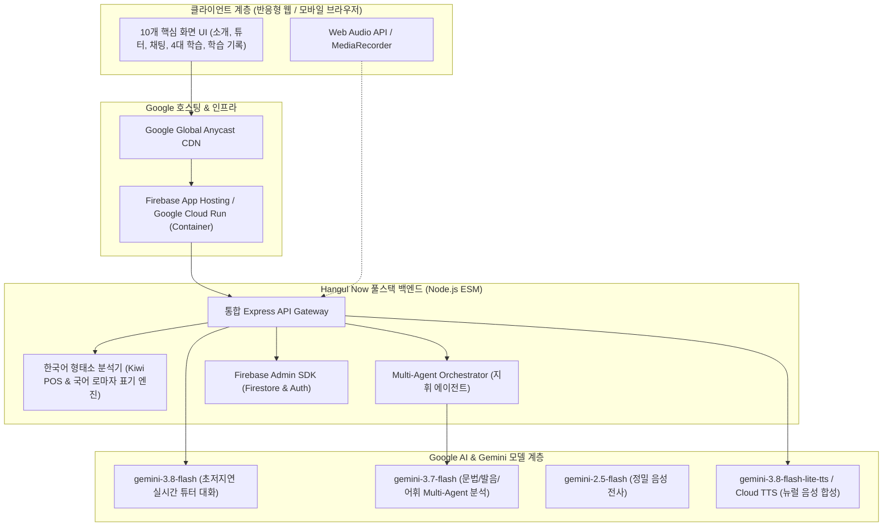

# Hangul Now (훈민정음) - Google 생태계 풀스택 교육 플랫폼

> **Google Gemini API + Google Cloud Platform + Firebase App Hosting & Cloud Run 기반**
> (Hnageul Copilot Multi-Agent 오케스트레이션 및 형태소 분석 엔진 통합)

Hangul Now는 영어를 사용하는 외국인 학습자가 메신저 형태의 AI 튜터 대화를 중심으로 한국어를 배우고, 대화에서 나온 표현을 듣기·읽기·쓰기·말하기의 4대 영역과 망각 곡선 기반 간격 반복(SRS) 복습으로 완성하는 차세대 한국어 학습 플랫폼입니다.

---

## 1. Google 생태계 풀스택 아키텍처



---

## 2. 핵심 구현 및 통합 기술

### 1) Multi-Agent AI 코칭 시스템 (`src/agents/`)
- **Main Orchestrator (`orchestrator.mjs`)**: 학습자의 발화 및 작문을 3개 서브 에이전트로 병렬 분기 후 통합 합성
- **Grammar Sub-Agent (`grammar-agent.mjs`)**: 조사, 어미, 시제, 경어체(높임말) 오류 정밀 진단
- **Phonetics Sub-Agent (`phonetics-agent.mjs`)**: 자음/모음, 받침, 연음, 비음화, 억양 분석
- **Vocabulary Sub-Agent (`vocabulary-agent.mjs`)**: 어휘 난이도(CEFR 레벨) 평가 및 자연스러운 대체 표현 추천
- **Context Compactor (`context-compactor.mjs`)**: 대화 컨텍스트 요약 및 토큰 최적화

### 2) 한국어 형태소 분석 및 언어학 엔진 (`src/pos/`)
- **Kiwi-NLP 어댑터**: 문장 내 단어 분해, 어간/어미/조사 분리
- **품사 색상 토큰화 (5-Class & Role)**: 주어(Subject), 화제(Topic), 목적어(Object), 서술어(Predicate) 자동 시각화
- **국립국어원 표준 로마자 표기법 변환**: `romanize.ts` 탑재
- **유니코드 한글 자모 조합 공식**: 초·중·종성 실시간 합성 및 분해

### 3) Firebase & Google Cloud 배포 최적화
- **Google Cloud Run**: 프로덕션용 경량 `Dockerfile` 및 자동 포트 바인딩
- **Firebase App Hosting**: `apphosting.yaml` 기반 차세대 풀스택 서버리스 배포
- **Firebase Firestore & Storage**: `firestore.rules`, `storage.rules` 보안 규칙 및 30일 보관 정책

---

## 3. 프로젝트 디렉터리 구성

```text
훈민정음/
├── preview/                      # 최적화된 독립형 웹 프로토타입 (10개 화면, 107KB)
│   ├── index.html                # 10개 화면 SPA
│   ├── js/dc-runtime.js          # 리액트 런타임 브릿지
│   └── assets/                   # 캐릭터 이미지 (훈이, 정이)
├── src/
│   ├── agents/                   # Multi-Agent 오케스트레이션 엔진
│   │   ├── orchestrator.mjs      # 메인 오케스트레이터
│   │   ├── grammar-agent.mjs     # 문법 에이전트
│   │   ├── phonetics-agent.mjs   # 발음/음성학 에이전트
│   │   ├── vocabulary-agent.mjs  # 어휘 에이전트
│   │   └── context-compactor.mjs # 컨텍스트 압축기
│   ├── pos/                      # 한국어 형태소 및 언어학 처리 엔진
│   ├── firebase.js               # Firebase Admin SDK 연동 (Firestore/Auth)
│   ├── geminiService.js          # Google Gemini API 직접 연동 서비스
│   ├── tts-verification.mjs      # 음성 평가 및 발음 검증 파이프라인
│   └── usage-meter.mjs           # 토큰 사용량 및 계측기
├── apphosting.yaml               # Firebase App Hosting 구성
├── Dockerfile                    # Google Cloud Run 배포용 Dockerfile
├── .dockerignore                 # 도커 빌드 제외 설정
├── firebase.json                 # Firebase 플랫폼 구성
├── firestore.rules               # Firestore 보안 규칙
├── storage.rules                 # Storage 보안 규칙
├── server.js                     # 엔터프라이즈 풀스택 Express 서버
├── package.json                  # 프로젝트 메타데이터 및 의존성
└── README.md                     # 기술 가이드
```

---

## 4. 백엔드 REST API 명세

| 메소드 | URI | 요청 페이로드 | 응답 및 기능 설명 |
| :--- | :--- | :--- | :--- |
| `GET` | `/api/health` | - | 시스템 상태, Gemini 모델 계층, Firebase 연동 확인 |
| `POST` | `/api/chat` | `{ tutorId, message, history, userId? }` | Gemini 3.8 Flash 실시간 튜터 대화 생성 및 Firestore 저장 |
| `POST` | `/api/coaching` | `{ userText, userAudio?, tutorId }` | **Multi-Agent 병렬 코칭 (문법+발음+어휘)** 종합 피드백 |
| `POST` | `/api/correction` | `{ sentence, userId? }` | 문장 교정 카드(JSON) 생성 및 오답 노트 자동 등록 |
| `POST` | `/api/pos/tag` | `{ sentence }` | 형태소 분해, 5대 품사 분류, 문장 성분(Role) 매핑 |
| `POST` | `/api/romanize` | `{ text }` | 국립국어원 표준 로마자 표기 변환 |
| `POST` | `/api/writing/feedback` | `{ topic, content }` | 작문 첨삭(diff) 및 총평 피드백 |
| `POST` | `/api/speaking/assess` | `{ targetSentence, userTranscript }` | 음절 단위 발음 정확도 점수 및 팁 |
| `POST` | `/api/session/artifact` | `{ sessionData }` | 학습 세션 마크다운 요약 아티팩트 자동 생성 |
| `POST` | `/api/session/quiz` | `{ mistakeItems }` | 오답 기반 맞춤형 복습 퀴즈 생성 |

---

## 5. 실행 및 배포 가이드

### (1) 로컬 개발 환경 실행
```bash
# 의존성 설치
npm install

# 서버 실행 (로컬 웹 + API)
npm run dev

# 접속 주소: http://localhost:3000
```

### (2) Google Cloud Run 배포
```bash
# Google Cloud 빌드 및 Cloud Run 원클릭 배포
gcloud run deploy hangul-now \
  --source . \
  --region asia-northeast3 \
  --allow-unauthenticated
```

### (3) Firebase App Hosting 배포
```bash
# Firebase CLI 로그인 및 App Hosting 초기화
firebase apphosting:backends:create --project <PROJECT_ID>
```
